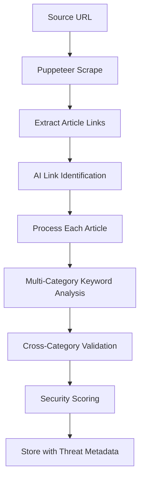
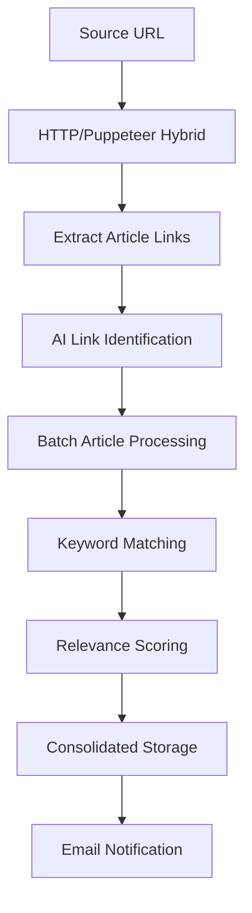

# Scraping Systems Comparison: Threat Tracker vs News Radar

## Executive Summary

The RisqAi platform employs two sophisticated scraping systems designed for different intelligence gathering needs. While both systems share core technologies and architectural patterns, they differ significantly in their approach to data processing, content validation, and user interaction models. This document provides a comprehensive analysis of their similarities, differences, and specialized capabilities.

## System Architecture Comparison

### Fundamental Approach

| Aspect | Threat Tracker | News Radar |
|--------|---------------|------------|
| **Primary Strategy** | Puppeteer-first with stealth focus | HTTP-first with Puppeteer fallback |
| **Target Content** | Cybersecurity threat intelligence | General news and business intelligence |
| **Processing Model** | Specialized, security-focused | Generalized, efficiency-focused |
| **User Isolation** | Per-user independent jobs | Global jobs with user-specific filtering |

### Technology Stack Similarities

Both systems share:
- **Puppeteer**: Advanced browser automation with stealth capabilities
- **OpenAI Integration**: GPT-4o-mini for content analysis and structure detection
- **Drizzle ORM**: Database operations and user management
- **Cheerio**: HTML parsing and DOM manipulation
- **Node.js/TypeScript**: Runtime environment and type safety

## Data Handling Methodologies

### Input Data Processing

#### Threat Tracker
```javascript
// Specialized keyword categorization
const keywords = {
  threats: threatTerms,     // Malware, vulnerabilities, attacks
  vendors: vendorTerms,     // Security companies, software vendors
  clients: clientTerms,     // Target organizations, customers
  hardware: hardwareTerms   // Devices, infrastructure
};
```

**Characteristics**:
- **Structured Categories**: Four distinct keyword categories with specific purposes
- **Cross-category Validation**: Requires keywords from multiple categories for relevance
- **Security-focused**: Tailored for cybersecurity threat intelligence
- **Precision-oriented**: Strict validation to prevent false positives

#### News Radar
```javascript
// Flat keyword structure
const activeKeywords = keywords
  .filter(k => k.active)
  .map(k => k.term);
```

**Characteristics**:
- **Flat Structure**: Simple array of active keywords
- **Flexible Matching**: Any keyword match triggers article processing
- **Broad Scope**: Supports diverse news topics and domains
- **Efficiency-focused**: Streamlined processing for high-volume sources

### Content Extraction Strategies

#### Threat Tracker: Puppeteer-Centric Approach

```javascript
// Always uses Puppeteer for maximum stealth and content access
scrapeUrl(url, isArticlePage, scrapingConfig)
├── Direct Puppeteer navigation
├── Bot protection evasion
├── Progressive content loading
├── Client-side content extraction
└── Structured HTML return
```

**Advantages**:
- **Maximum Compatibility**: Handles heavily protected cybersecurity sites
- **Complete Content Access**: Full JavaScript execution and dynamic loading
- **Stealth Capabilities**: Advanced bot detection evasion
- **Reliable Extraction**: Consistent results across different site types

**Trade-offs**:
- **Resource Intensive**: Higher CPU and memory usage
- **Slower Processing**: Longer execution times per article
- **Complex Error Handling**: Browser-specific failure modes

#### News Radar: Hybrid Optimization

```javascript
// Intelligent HTTP-first with Puppeteer fallback
scrapeUrl(url, isSourceUrl, config)
├── HTTP request attempt
├── Protection/dynamic content detection
├── Automatic Puppeteer fallback
└── Optimized content return
```

**Advantages**:
- **Performance Optimized**: Fast HTTP requests for unprotected content
- **Resource Efficient**: Minimal overhead for simple sites
- **Adaptive**: Scales complexity based on site requirements
- **High Throughput**: Processes more articles per time unit

**Trade-offs**:
- **Variable Success**: Some protected sites may remain inaccessible
- **Detection Complexity**: Requires sophisticated fallback triggers
- **Inconsistent Timing**: Variable processing times based on site complexity

## Data Processing Workflows

### Threat Tracker: Security-Focused Pipeline



**Processing Characteristics**:
1. **Comprehensive Analysis**: Every article undergoes full AI analysis
2. **Multi-dimensional Validation**: Keywords must span multiple categories
3. **Security Scoring**: Specialized severity assessment
4. **Threat Metadata**: Rich categorization for security professionals

### News Radar: Efficiency-Focused Pipeline



**Processing Characteristics**:
1. **Streamlined Flow**: Optimized for high-volume processing
2. **Flexible Matching**: Any relevant keyword triggers processing
3. **Batch Operations**: Efficient handling of multiple articles
4. **User Notifications**: Consolidated email alerts

## OpenAI Integration Patterns

### Threat Tracker: Specialized AI Analysis

#### Content Analysis
```javascript
analyzeContent(content, title, threats, vendors, clients, hardware)
├── Multi-category keyword detection
├── Security relevance assessment
├── Threat severity scoring
├── Comprehensive summarization
└── Structured threat intelligence
```

**AI Prompt Strategy**:
- **Security-focused**: Prompts tailored for cybersecurity context
- **Multi-category**: Analyzes across four distinct keyword categories
- **Severity Assessment**: Includes threat level evaluation
- **Professional Audience**: Outputs formatted for security professionals

#### HTML Structure Detection
```javascript
detectHtmlStructure(html, sourceUrl)
├── Cybersecurity site optimization
├── Complex selector detection
├── Alternative selector provision
├── Security-specific elements
└── Robust fallback options
```

### News Radar: Generalized AI Analysis

#### Content Analysis
```javascript
analyzeContent(content, activeKeywords, title)
├── General keyword detection
├── Relevance scoring
├── Content summarization
└── Structured output
```

**AI Prompt Strategy**:
- **Broad Scope**: Handles diverse news topics
- **Efficiency-focused**: Streamlined prompts for faster processing
- **General Audience**: Outputs suitable for business intelligence
- **Scalable**: Optimized for high-volume processing

#### Date Extraction
```javascript
extractPublishDate(content, title, html)
├── Multi-format date parsing
├── Context-aware extraction
├── Validation and normalization
└── Fallback strategies
```

## Database Storage Patterns

### Threat Tracker: Rich Metadata Storage

```javascript
// Comprehensive threat article structure
{
  sourceId,
  title,
  content,
  url: normalizedUrl,
  author,
  publishDate,
  summary,
  relevanceScore,
  securityScore,           // Unique to threat tracker
  detectedKeywords: {      // Structured categories
    threats: [],
    vendors: [],
    clients: [],
    hardware: []
  },
  userId
}
```

**Storage Characteristics**:
- **Rich Metadata**: Extensive categorization and scoring
- **Security Metrics**: Specialized threat assessment data
- **Structured Keywords**: Organized by category for analysis
- **Professional Context**: Optimized for security workflow integration

### News Radar: Streamlined Article Storage

```javascript
// Efficient news article structure
{
  sourceId,
  userId,
  title,
  content,
  url,
  author,
  publishDate,
  summary,
  relevanceScore,
  detectedKeywords: []     // Flat array structure
}
```

**Storage Characteristics**:
- **Streamlined Schema**: Optimized for performance and simplicity
- **Flat Structure**: Simple keyword array for efficient querying
- **General Purpose**: Suitable for diverse news content types
- **Scalable**: Designed for high-volume article storage

## User Experience and Job Management

### Threat Tracker: Independent User Jobs

```javascript
// Per-user job isolation
userJobsRunning.set(userId, true);
```

**Job Management Features**:
- **Parallel Processing**: Multiple users can run jobs simultaneously
- **User Isolation**: Complete separation of processing contexts
- **Personalized Keywords**: User-specific keyword categories
- **Independent Scheduling**: Per-user job timing and management

### News Radar: Global Job Coordination

```javascript
// Single global job coordination
if (globalJobRunning) {
  return { success: false, message: "Job already running" };
}
```

**Job Management Features**:
- **Resource Optimization**: Single global job prevents resource conflicts
- **Centralized Scheduling**: Unified job timing across all users
- **Consolidated Notifications**: Batch email delivery
- **Shared Processing**: Efficient resource utilization

## Performance and Scalability Characteristics

### Threat Tracker Performance Profile

| Metric | Characteristic | Impact |
|--------|---------------|---------|
| **Processing Speed** | Slower, thorough | Higher accuracy, lower throughput |
| **Resource Usage** | High (Puppeteer-only) | Better compatibility, more overhead |
| **Accuracy** | Very High | Specialized validation, fewer false positives |
| **Scalability** | User-parallel | Horizontal scaling per user |

### News Radar Performance Profile

| Metric | Characteristic | Impact |
|--------|---------------|---------|
| **Processing Speed** | Faster, adaptive | Higher throughput, variable accuracy |
| **Resource Usage** | Optimized (HTTP-first) | Better efficiency, some limitations |
| **Accuracy** | High | General validation, occasional false positives |
| **Scalability** | Vertically optimized | Single-instance scaling |

## Error Handling and Resilience

### Threat Tracker: Comprehensive Error Management

```javascript
// Individual article failure isolation
try {
  const newArticle = await processArticle(url, sourceId, userId, htmlStructure, keywords);
  if (newArticle) results.push(newArticle);
} catch (error) {
  log(`Error processing article: ${error.message}`, "scraper-error");
  return null; // Continue with next article
}
```

**Error Handling Characteristics**:
- **Granular Isolation**: Individual article failures don't affect others
- **Comprehensive Logging**: Detailed error tracking for debugging
- **Graceful Degradation**: Fallback selectors and alternative approaches
- **User Context Preservation**: Maintains user-specific processing state

### News Radar: Efficient Error Recovery

```javascript
// Source-level error isolation with job continuation
try {
  const { processedCount, savedCount, newArticles } = await scrapeSource(source.id);
  results.push({ sourceId: source.id, sourceName: source.name, processed: processedCount, saved: savedCount });
} catch (error) {
  results.push({ sourceId: source.id, sourceName: source.name, processed: 0, saved: 0, error: error.message });
}
```

**Error Handling Characteristics**:
- **Source-level Isolation**: Failed sources don't stop the entire job
- **Retry Mechanisms**: Automatic retry with progressive delays
- **Fallback Strategies**: HTTP to Puppeteer, selector alternatives
- **Continued Processing**: Job completion despite individual failures

## Integration Patterns

### Threat Tracker: Security Ecosystem Integration

```javascript
// Specialized security workflow integration
const analysis = await analyzeContent(content, title, threats, vendors, clients, hardware);
const securityScore = analysis.severityScore?.toString() || "0";
```

**Integration Characteristics**:
- **SIEM Compatibility**: Structured data suitable for security tools
- **Threat Intelligence**: Rich metadata for security analysis
- **Professional Workflow**: Designed for security team integration
- **Compliance Ready**: Audit trails and comprehensive logging

### News Radar: Business Intelligence Integration

```javascript
// General business intelligence workflow
const analysis = await analyzeContent(article.content, activeKeywords, article.title);
await sendNewArticlesEmail(userId, allNewArticles, undefined, true);
```

**Integration Characteristics**:
- **BI Tool Compatibility**: Standard data formats for business analysis
- **Notification Systems**: Email integration for stakeholder updates
- **Dashboard Ready**: Optimized for business dashboard consumption
- **Reporting Friendly**: Structured for executive reporting

## Unique Capabilities and Specializations

### Threat Tracker Unique Features

1. **Advanced Bot Evasion**: Sophisticated techniques for security site access
2. **Multi-category Validation**: Cross-category keyword requirements
3. **Security Scoring**: Specialized threat severity assessment
4. **Stealth Operations**: Designed to avoid detection on sensitive sites
5. **Professional Metadata**: Rich context for security professionals

### News Radar Unique Features

1. **Hybrid Efficiency**: Intelligent HTTP/Puppeteer selection
2. **Dynamic Content Handling**: Advanced HTMX and lazy loading support
3. **Global Scheduling**: Centralized job coordination across users
4. **Consolidated Notifications**: Batch email delivery system
5. **High-throughput Processing**: Optimized for volume handling

## Conclusion

Both systems demonstrate sophisticated approaches to web intelligence gathering, with their differences reflecting their specialized use cases:

**Threat Tracker** prioritizes accuracy, stealth, and comprehensive analysis for cybersecurity professionals who need reliable, categorized threat intelligence despite processing overhead.

**News Radar** emphasizes efficiency, scalability, and broad coverage for business intelligence users who need high-volume news processing with good accuracy and fast delivery.

Together, they provide a comprehensive intelligence gathering platform that serves both specialized security needs and general business intelligence requirements, leveraging shared technologies while maintaining distinct approaches optimized for their respective domains.