# darkreading.com Technical Analysis & Request Flow

**Target Site**: https://www.darkreading.com
**Source ID**: `14f88bac-af3d-4389-9afc-7ac79042f51a`
**Site Type**: General cybersecurity news
**Protection Level**: HIGH (Cloudflare + Advanced Bot Detection)

## Request Flow Analysis

### Successful Flow (Replit Environment)

```mermaid
graph TD
    A[Replit Request] --> B[Dynamic IP Pool]
    B --> C[DNS: darkreading.com → Cloudflare]
    C --> D[TLS Handshake Success]
    D --> E[Cloudflare Challenge Presented]
    E --> F[Challenge Bypass/Extraction]
    F --> G[Content Extracted: 5136 chars, 1 link]
    G --> H[Success: Confidence 45%]

    style A fill:#e8f5e8
    style H fill:#e8f5e8
```



### Failed Flow (Azure Container Apps)

```mermaid
graph TD
    A[Azure Request] --> B[Static IP: 4.157.217.180]
    B --> C[DNS: darkreading.com → Cloudflare]
    C --> D[TLS Handshake Success]
    D --> E[Cloudflare Enhanced Protection]
    E --> F[403 Forbidden - No Bypass]
    F --> G[CycleTLS Silent Failure]
    G --> H[Puppeteer Fallback Fails]
    H --> I[Complete Failure: No Content]

    style A fill:#f8e8e8
    style F fill:#f8e8e8
    style G fill:#f8e8e8
    style I fill:#f8e8e8
```



## Site Configuration Analysis

### darkreading.com Source Configuration
```json
{
  "id": "14f88bac-af3d-4389-9afc-7ac79042f51a",
  "url": "https://www.darkreading.com",
  "name": "Darkreading",
  "category": "general",
  "enabled": true,
  "priority": 50,
  "last_scraped": "2025-09-09 17:25:07.75"
}
```

### Content Structure (Based on Successful Replit Extraction)
```json
{
  "contentLength": 5136,
  "linkCount": 1,
  "confidence": 45,
  "extractionMethod": "protection_bypass",
  "status": "success_with_challenges"
}
```

## Protection Mechanisms Identified

### 1. Cloudflare Protection Stack
- **Primary**: Cloudflare CDN (`104.16.222.171`, `104.16.224.171`)
- **Secondary**: Bot Challenge system
- **Tertiary**: IP reputation filtering
- **Advanced**: Browser fingerprinting + behavioral analysis

### 2. IP-Based Filtering
```bash
# Azure IP Analysis
IP: 4.157.217.180
Organization: Microsoft Corporation
ASN: AS8075
Country: United States
Region: Virginia
ISP Type: Datacenter/Cloud Provider

# Risk Factors for darkreading.com
✓ Datacenter IP (High Risk)
✓ Microsoft Corporation (Known Cloud Provider)
✓ Static IP (Predictable)
✓ Virginia Location (Common Bot Origin)
```

### 3. Advanced Bot Detection Signatures

#### Request Headers Analysis
**Replit (Working)**:
```http
User-Agent: Mozilla/5.0 (Varied/Dynamic)
Accept: text/html,application/xhtml+xml...
Accept-Language: en-US,en;q=0.9
X-Forwarded-For: (Residential-style IP)
```

**Azure (Failing)**:
```http
User-Agent: Mozilla/5.0 (Windows NT 10.0; Win64; x64)...
Accept: text/html,application/xhtml+xml...
Accept-Language: en-US,en;q=0.9
X-Forwarded-For: 4.157.217.180
```

#### Environment Fingerprinting
| Detection Vector | Replit | Azure | Risk Level |
|-----------------|---------|--------|------------|
| IP Geolocation | Dynamic | Microsoft Datacenter | 🔴 **Critical** |
| WebRTC Leaks | Masked | Container IP | 🟠 **High** |
| Canvas Fingerprint | Variable | Container-consistent | 🟠 **High** |
| Navigator Properties | Dynamic | Container-static | 🟡 **Medium** |
| Timing Patterns | Natural | Consistent/Automated | 🟡 **Medium** |

## Error Pattern Analysis

### Azure Error Logs (August 2025)
```
2025-08-21 11:57:41.645 - Both HTTP and Puppeteer failed for: https://www.darkreading.com
Stack: Error: Both HTTP and Puppeteer failed for: https://www.darkreading.com
  at getContent (/app/backend/dist/index.js:108142:11)
  at async StreamlinedUnifiedScraper.scrapeSourceUrl
```

### Failure Points Identified
1. **CycleTLS Silent Failures** - Binary returns null without errors
2. **HTTP Scraper 403 Response** - Cloudflare blocking with Ray ID
3. **Puppeteer Protection Bypass Fails** - Container fingerprinting detected
4. **No Fallback Recovery** - All methods exhaust without content extraction

### Request Timing Analysis
```
Replit Successful Request:
DNS Resolution: ~15ms
TLS Handshake: ~120ms
Challenge Processing: ~2-5s
Content Extraction: ~1-3s
Total: ~3-8s

Azure Failed Request:
DNS Resolution: ~25ms (Azure DNS)
TLS Handshake: ~150ms
Protection Check: ~1-2s
Immediate Block: 403 response
Total: ~2s (Fast failure)
```

## CycleTLS Integration Analysis

### Current Implementation Issues

```typescript
// Current CycleTLS Manager Issues
class CycleTLSManager {
  private async validateArchitecture(): Promise<boolean> {
    // ❌ Only checks module loading, not actual network functionality
    // ❌ No verification against live protected sites like darkreading.com
    // ❌ No fallback strategy when binary is incompatible
  }
}
```

### darkreading.com Specific Requirements

Based on successful Replit behavior, darkreading.com requires:

1. **TLS Fingerprinting**: JA3 signature matching real browsers
2. **Session Persistence**: Cloudflare challenges require maintained sessions
3. **IP Reputation**: Non-datacenter IP addresses for initial handshake
4. **Timing Authenticity**: Human-like request timing patterns

### Recommended CycleTLS Configuration

```typescript
// darkreading.com optimized config
const darkReadingConfig: ClientConfig = {
  ja3: "chrome_122", // Latest Chrome fingerprint
  userAgent: "Mozilla/5.0 (Windows NT 10.0; Win64; x64) AppleWebKit/537.36 (KHTML, like Gecko) Chrome/122.0.0.0 Safari/537.36",
  timeout: 30000,
  disableRedirect: false,
  // Additional headers to mimic real browser
  headers: {
    "Accept": "text/html,application/xhtml+xml,application/xml;q=0.9,image/avif,image/webp,image/apng,*/*;q=0.8",
    "Accept-Language": "en-US,en;q=0.9",
    "Accept-Encoding": "gzip, deflate, br",
    "Cache-Control": "max-age=0",
    "Sec-Fetch-Dest": "document",
    "Sec-Fetch-Mode": "navigate",
    "Sec-Fetch-Site": "none",
    "Sec-Fetch-User": "?1",
    "Upgrade-Insecure-Requests": "1"
  }
};
```

## Protection Bypass Strategy

### Phase 1: Environment Masking
```typescript
// Azure Container Environment Masking
const environmentMasking = {
  // Override container-specific characteristics
  navigator: {
    vendor: "Google Inc.",
    platform: "Win32",
    hardwareConcurrency: 8, // Randomized
    languages: ["en-US", "en"],
    webdriver: undefined // Critical: Remove webdriver property
  },

  // Mask container networking
  connection: {
    effectiveType: "4g",
    rtt: 50 + Math.random() * 100, // Randomized latency
    downlink: 10 + Math.random() * 40
  }
};
```

### Phase 2: Session Warming
```typescript
// darkreading.com specific session warming
const sessionWarmingFlow = async (client: CycleTLSClient) => {
  // 1. Initial homepage visit (establish session)
  await client.get("https://www.darkreading.com", {
    headers: standardBrowserHeaders
  });

  // 2. Wait for realistic user behavior timing
  await new Promise(resolve => setTimeout(resolve, 1000 + Math.random() * 2000));

  // 3. Navigate to actual target (article links page)
  return await client.get("https://www.darkreading.com", {
    headers: {
      ...standardBrowserHeaders,
      "Referer": "https://www.darkreading.com"
    }
  });
};
```

### Phase 3: Enhanced Challenge Resolution
```typescript
// Cloudflare challenge automation for darkreading.com
const cloudflareBypass = {
  // Detect challenge types
  detectChallenge: (response: string) => {
    if (response.includes("cf-browser-verification")) return "browser_verification";
    if (response.includes("cf-challenge-running")) return "js_challenge";
    if (response.includes("cf-turnstile")) return "turnstile";
    return "none";
  },

  // Execute appropriate bypass
  executeBypass: async (challengeType: string, page: Page) => {
    switch (challengeType) {
      case "browser_verification":
        return await handleBrowserVerification(page);
      case "js_challenge":
        return await handleJsChallenge(page);
      case "turnstile":
        return await handleTurnstile(page);
      default:
        return true; // No challenge detected
    }
  }
};
```

## Site-Specific Optimizations

### darkreading.com Custom Handler
```typescript
export class DarkReadingHandler {
  private static readonly DOMAIN = "darkreading.com";
  private static readonly BASE_URL = "https://www.darkreading.com";

  // Custom request flow optimized for darkreading.com
  async scrape(url: string): Promise<ScrapingResult> {
    // 1. Pre-flight checks
    if (!url.includes(this.DOMAIN)) {
      throw new Error("Handler only supports darkreading.com");
    }

    // 2. Environment-specific routing
    if (process.env.IS_AZURE === "true") {
      return await this.azureOptimizedScrape(url);
    } else {
      return await this.standardScrape(url);
    }
  }

  private async azureOptimizedScrape(url: string): Promise<ScrapingResult> {
    // Azure-specific optimizations
    // - Residential proxy routing
    // - Enhanced fingerprint masking
    // - Extended timeout handling
    // - Fallback strategy chain
  }
}
```

## Recommended Testing Strategy

### 1. Controlled Environment Testing
```bash
# Test CycleTLS binary compatibility
npm run test:cycletls-arch

# Test darkreading.com specific bypass
npm run test:darkreading-bypass

# Test Azure environment simulation
npm run test:azure-simulation
```

### 2. Progressive Rollout Testing
1. **Local Testing**: Ensure no regression in local development
2. **Replit Testing**: Verify continued functionality in Replit
3. **Azure Staging**: Test fixes in Azure staging environment
4. **Production Deployment**: Gradual rollout with monitoring

### 3. Success Metrics
```typescript
const successMetrics = {
  // Technical metrics
  cycleTlsSuccess: ">95%",
  httpFallbackRate: "<20%",
  responseTime: "<30s",

  // Content quality metrics
  contentExtractionRate: ">90%",
  averageContentLength: ">1000 chars",
  linkExtractionCount: ">5 links",

  // Environmental metrics
  azureSuccessRate: ">90%", // Match Replit performance
  errorReduction: ">80%", // Compared to current state
  uptimeImprovement: ">95%" // Reliable scraping
};
```

## Implementation Priority Matrix

| Fix | Impact | Effort | Priority | Timeline |
|-----|---------|---------|----------|----------|
| CycleTLS Architecture Verification | 🔴 Critical | 🟡 Medium | **P0** | Day 1 |
| IP-based Blocking Mitigation | 🔴 Critical | 🔴 High | **P0** | Day 1-2 |
| Cloudflare Bypass Enhancement | 🟠 High | 🟠 High | **P1** | Day 2-3 |
| Environment Fingerprint Masking | 🟡 Medium | 🟡 Medium | **P2** | Day 3-4 |
| Site-specific Handler Implementation | 🟡 Medium | 🟠 High | **P2** | Day 4-5 |

---

**Next Steps**:
1. Implement CycleTLS architecture validation fixes
2. Research Azure IP alternatives and proxy integration
3. Deploy enhanced diagnostic logging to capture live failure patterns
4. Test fixes against darkreading.com in controlled Azure environment

**Success Criteria**: darkreading.com scraping success rate >90% in Azure, matching Replit performance